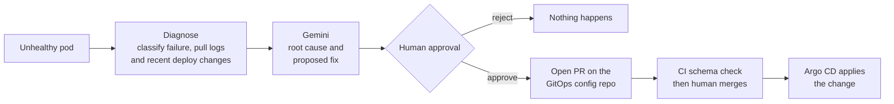

# GitOps-Gated Kubernetes Incident Remediation Agent

An agent that notices common Kubernetes failures, works out what went wrong with an LLM, and opens a pull request with a proposed fix. It can read your cluster but it can't change it. Every fix goes through a normal PR review, and a human merges it.

**Maturity: suggest-only.** It diagnoses and proposes. It does not auto-remediate, and that's deliberate.

## Why I built it this way

Plenty of "AI SRE" demos give the model direct `kubectl` access. That works right up until it confidently applies a wrong fix to a live cluster and nobody sees it coming.

This project goes the other way. The agent's Kubernetes credentials are read-only, enforced by RBAC and checked by an automated test, so a write attempt gets a real `403` from the API server. The only place it can write to is a git branch, and nothing reaches the cluster until a person merges that branch. The LLM's reach is limited by the infrastructure, not by a line in a prompt asking it to behave.

## How a run works



The pipeline is a LangGraph graph with an `interrupt()` before the PR step. There's no edge from the proposal straight to PR creation, so skipping approval would mean rewriting the graph, not flipping a flag.

## Failure classes it recognizes

| Class | What it means |
|---|---|
| `OOMKilled` | Container exceeded its memory limit |
| `CrashLoopBackOff` | Container keeps exiting on startup |
| `ImagePullBackOff` / `ErrImagePull` | Bad or missing image reference |

HPA thrashing is **not** detected. See [Known limitations](#known-limitations).

## Quick start (local)

You'll need Docker Desktop, `kubectl`, `kind`, Python 3.11 or 3.12, a [Gemini API key](https://aistudio.google.com/apikey), and a GitHub repo to act as your GitOps config repo.

The commands below are PowerShell. The `.sh` equivalents of the helper scripts are in `infra/`.

### 1. The GitOps config repo

The agent opens PRs against a separate repo, not this one. Create an empty GitHub repo (for example `k8s-gitops-config`) and push the contents of `gitops-repo-seed/` to it, as the root of that repo. Its own README explains the layout. It also includes a CI workflow that schema-checks every PR with `kubeconform`.

Then create a **fine-grained** GitHub token scoped to only that repo, with Contents and Pull requests set to read/write. Don't use a classic token.

### 2. Configure

```powershell
Copy-Item .env.example .env
```

Fill in `GEMINI_API_KEY`, `GIT_TOKEN`, `GIT_REPO` (as `your-username/k8s-gitops-config`) and `GIT_BASE_BRANCH`. `.env` is gitignored.

```powershell
python -m venv .venv
.venv\Scripts\activate
pip install -e ".[dev]"
```

### 3. Start the cluster and lock down the agent

```powershell
kind create cluster --config infra/kind-config.yaml
kubectl get nodes    # wait until both are Ready

kubectl apply -f configs/rbac/service-account.yaml
kubectl apply -f configs/rbac/cluster-role.yaml
kubectl apply -f configs/rbac/cluster-role-binding.yaml

Set-ExecutionPolicy -Scope Process -ExecutionPolicy Bypass
.\infra\generate-agent-kubeconfig.ps1
python scripts/verify_rbac.py
```

`verify_rbac.py` should print a successful read and then a `403 Forbidden` on a write. If it doesn't, stop and fix that before going further.

### 4. Break something on purpose

```powershell
kubectl apply -f configs/failure-scenarios/00-namespace.yaml
kubectl apply -f configs/failure-scenarios/01-oom-killed.yaml
Start-Sleep -Seconds 30
kubectl get pods -n failure-lab
```

You should see the pod cycling through `OOMKilled` and `CrashLoopBackOff`. `02-crashloop-backoff.yaml` and `03-image-pull-backoff.yaml` work the same way. The HPA scenario needs `scripts/install-metrics-server.sh` first, and it's timing-dependent, so treat it as best effort.

### 5. Run the agent

```powershell
python scripts/run_agent.py failure-lab
```

It prints the diagnosis and the proposed patch, then waits. Type `y` and it opens a PR on your GitOps repo. Type `n` and nothing happens anywhere.

Docker Desktop hands kind a new host port every time it restarts, so after a reboot `kubectl` often points at a dead port. Don't debug it. Run `kind delete cluster --name incident-agent-dev`, recreate it, and redo steps 3 and 4. The cluster is disposable by design.

## Running it as an API

```powershell
.\infra\generate-agent-kubeconfig-docker.ps1
docker compose up --build
```

Interactive docs are at `http://127.0.0.1:8000/docs`.

| Endpoint | What it does |
|---|---|
| `GET /health` | Liveness check |
| `GET /diagnostics/{namespace}` | Read-only scan. No LLM call, safe to poll |
| `POST /incidents/{namespace}/scan` | Diagnose and propose. Pauses at approval and returns a `thread_id` |
| `POST /incidents/{thread_id}/decision` | Resume with `{"approved": true}` or `false` |
| `POST /webhook/cluster-event` | Stub entrypoint for an external alert source |

Approval is split across two calls because an HTTP request can't sit waiting for a person. Same pause-and-resume mechanism as the CLI, just addressed by `thread_id`. If the server restarts between the two calls, the pending approval is lost and `/decision` returns a clear `404`.

The container can't use the host's `127.0.0.1` to reach kind, because inside a container that address means the container itself. The `-docker` kubeconfig points at the control-plane node by name over kind's own Docker network instead, and `docker-compose.yml` joins that network.

## Closing the loop with Argo CD

Without this, merging a PR changes the repo and then someone still has to run `kubectl apply`. Argo CD takes over that last step. It doesn't touch the approval gate, because it only starts working after a merge.

```powershell
kubectl create namespace argocd
kubectl apply -n argocd --server-side --force-conflicts -f https://raw.githubusercontent.com/argoproj/argo-cd/stable/manifests/install.yaml
kubectl -n argocd rollout status deployment/argocd-server --timeout=180s
```

Edit `repoURL` in `configs/argocd/incident-agent-app.yaml` to point at your GitOps repo, then apply it. If that repo is private, Argo CD needs credentials first, otherwise you'll see `authentication required: Repository not found`:

```powershell
kubectl apply -f configs/argocd/incident-agent-app.yaml

kubectl create secret generic gitops-repo-creds -n argocd `
  --from-literal=type=git `
  --from-literal=url=https://github.com/YOUR-USERNAME/k8s-gitops-config `
  --from-literal=username=YOUR-USERNAME `
  --from-literal=password=YOUR-GIT-TOKEN
kubectl label secret gitops-repo-creds -n argocd argocd.argoproj.io/secret-type=repository
```

To open the UI:

```powershell
kubectl port-forward svc/argocd-server -n argocd 8080:443

$encoded = kubectl -n argocd get secret argocd-initial-admin-secret -o jsonpath="{.data.password}"
[System.Text.Encoding]::UTF8.GetString([System.Convert]::FromBase64String($encoded))
```

Log in at `https://localhost:8080` as `admin` with that password. The Application uses `selfHeal` (manual edits get reverted to match git) and `prune` (resources deleted from git are deleted from the cluster).

Argo CD tracks two separate things. **Sync** says whether the cluster matches git. **Health** says whether the workload is actually working. The demo pods are broken on purpose, so "synced but unhealthy" is exactly what you should see.

## What a proposal looks like

The PR body the agent writes has this shape. The values below come from a real run:

```
Automated incident remediation proposal
(Opened by an automated agent with read-only cluster access.
 A human must review and merge.)

What it saw
- Pod: oom-demo-76ddc94454-rdgmv (namespace failure-lab)
- Failure class: oom_killed, reason OOMKilled, restart count 40

Root cause (high confidence)
The container exceeded its memory limit and was terminated by the
kernel OOM killer.

Proposed change
Increase the memory limit and request for the stress container.

    resources:
      limits:   { memory: 256Mi }
      requests: { memory: 128Mi }

Risk notes
If the workload allocates memory without bound, raising the limit only
delays the next OOMKill. Check node capacity first.
```

## Tests

```powershell
pytest -m "not integration" -v    # 32 tests, mocked, no cluster or API keys needed
pytest -m integration -v          # needs the kind cluster up and RBAC applied
```

Unit tests cover the classifier, the log edge cases, the YAML patch merge, the GitHub PR flow, the serialization boundary in the graph, and every API endpoint. The integration tests are the RBAC checks: one confirms reads work, one confirms a write is rejected.

## Project layout

```
src/
  agent/      classifier, Gemini client, LangGraph graph, models
  k8s/        read-only Kubernetes client
  gitops/     YAML patch merge, GitHub PR client
  api/        FastAPI app and settings
configs/
  rbac/               ServiceAccount, ClusterRole, ClusterRoleBinding
  failure-scenarios/  manifests that fail on purpose
  argocd/             Argo CD Application
infra/        kind config, kubeconfig generation scripts (.ps1 and .sh)
scripts/      CLI entry points: scan, propose, run, verify RBAC
tests/
gitops-repo-seed/   contents for the SEPARATE GitOps config repo
```

## RBAC policy

The full file is `configs/rbac/cluster-role.yaml`. It grants `get`, `list` and `watch` on pods, events, deployments, replicasets and HPAs, plus `get` on pod logs. No create, update, patch or delete verb appears anywhere in it.

## Taking this to production

This was built and tested only on a local `kind` cluster. Before pointing it at anything real, I'd change these things first:

| Area | Now | For production |
|---|---|---|
| RBAC scope | `ClusterRoleBinding`, cluster-wide | Namespaced `Role` and `RoleBinding` for the namespaces it should watch |
| Cluster credentials | Static token in a kubeconfig | Workload identity (IRSA on EKS, Workload Identity on GKE) |
| Approval state | `InMemorySaver`, lost on restart | `PostgresSaver` or `SqliteSaver` |
| API access | No authentication | Auth in front of every endpoint, since anyone who can reach it can approve a PR |
| Scaling | Process-global state, one replica | Move state out of the process before running more than one replica |
| Triggering | Manual, or a stub webhook | Real alert source such as Alertmanager |
| Observability | `print()` in the scripts | Structured logging and metrics |

## Known limitations

**HPA thrashing isn't detected.** The other failure classes show up as a status at one point in time. Thrashing is a pattern over time, so it needs time-series data that a single snapshot can't give. The scenario manifests exist for manual testing, but nothing in the classifier looks for it.

**"Recent deploy changes" come from ReplicaSet history, not git.** This setup has no GitOps controller applying changes from git when the failure happens, so the agent compares consecutive Deployment revisions instead. With Argo CD or Flux in the loop, reading real git history would be the better source.

**LLM output isn't deterministic.** Two runs on the same failure can word things differently or pick different memory values. Once Gemini returned a YAML patch with escaped newlines, which broke parsing. The patch step now normalizes that and fails with a clear message if the patch still can't be parsed. Treat every proposal as a suggestion to review.

**The patch merge rewrites the whole file.** It uses PyYAML, so comments and key order in the manifest are lost when a patch is committed. `ruamel.yaml` would preserve them.

**The GitOps repo layout is hardcoded.** The agent expects `manifests/<deployment-name>.yaml`. Repos built on Kustomize or Helm won't work.

**One incident per run.** If several pods are unhealthy, only the first is handled.

**`structlog` is declared but not used.** Logging is plain `print()` in the CLI scripts. I'd wire it in properly before calling this production-ready.

**CI only checks schema.** `kubeconform` catches typos and wrong types, but not things that need a live API server, like admission webhooks or missing ConfigMaps.

## Troubleshooting

**`kubectl` says connection refused on some `127.0.0.1` port.** kind's host port changed after a Docker restart. Recreate the cluster.

**`pytest` can't import `src`.** `conftest.py` at the repo root handles this. If it still fails, check that the file exists and was actually saved.

**A container can't reach the cluster.** Use `generate-agent-kubeconfig-docker.ps1` and make sure the kind cluster is running, so the `kind` Docker network exists.

**Gemini returns a 404 for the model.** `gemini-3.7-flash` may not be enabled for your key or tier. List what you have with `client.models.list()` and change `MODEL_NAME` in `src/agent/gemini_client.py`.

**`repo.get_contents` returns a 404 when opening a PR.** The manifest isn't in your GitOps repo yet, or `GIT_REPO` is wrong. The file must be at `manifests/<deployment-name>.yaml`.

**`/decision` returns a 404.** That `thread_id` has no pending approval. Either it was already decided, or the server restarted after the `/scan` call.

**`.ps1` scripts are blocked.** Run `Set-ExecutionPolicy -Scope Process -ExecutionPolicy Bypass` in that terminal. It only lasts for that window.

## License

MIT. See `LICENSE`.