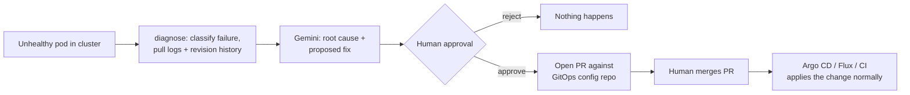

# GitOps-Gated Kubernetes Incident Remediation Agent

An agent that watches for a handful of common Kubernetes failures, figures out what's wrong using an LLM, and opens a pull request with a proposed fix. It never touches the cluster except to read from it — every actual change goes through a normal PR review and merge, the same as any other config change would.

## Why it's built this way

Most "AI SRE" demos give the model direct `kubectl apply` access. That's the part that makes them unusable for anything real: a wrong or hallucinated fix lands straight on a live cluster, with nobody checking it first.

This agent can't do that even if it wanted to. Its Kubernetes credentials are read-only, enforced by RBAC and verified with an actual test (not just "the prompt tells it not to write anything"). The only thing it's capable of writing to is a git branch, and only a human merging that branch causes anything to change in the cluster. That's the whole design — everything else here is plumbing to make that one property true and demonstrable end to end.

**Stage this reaches: suggest-only.** It diagnoses, proposes, and opens a PR. It does not auto-remediate, and it's not meant to.

## How a run actually goes



The agent's own involvement stops at step F. Everything after that is just a normal git workflow.

## Failure classes it recognizes

- `OOMKilled` — container exceeded its memory limit
- `CrashLoopBackOff` — container keeps exiting on startup
- `ImagePullBackOff` / `ErrImagePull` — bad or missing image reference
- HPA thrashing — **detection not implemented**, see Limitations

## Repo layout

```
src/
  agent/      classifier, Gemini client, LangGraph graph, pydantic models
  k8s/        read-only Kubernetes client wrapper
  gitops/     GitHub PR client, YAML patch-merge logic
  api/        FastAPI wrapper (settings, routes)
configs/
  rbac/       ServiceAccount + ClusterRole + ClusterRoleBinding (read-only)
  failure-scenarios/   manifests that deliberately break in each way, for local testing
infra/        kind cluster config, kubeconfig-generation scripts
scripts/      manual CLI entry points (scan, propose, run, verify)
tests/        unit tests, mostly mocked; a couple of integration tests need a live cluster
gitops-repo-seed/   NOT part of this repo — contents for a separate GitOps config repo
```

That last one trips people up (it tripped me up while building this): `gitops-repo-seed/` is the starting point for a *second*, separate GitHub repo. The agent opens PRs against that repo, not this one.

## Running it locally

You need Docker Desktop, `kubectl`, and `kind`. On Windows without Chocolatey, `kind` is a single binary — grab it directly from the [kind releases page](https://github.com/kubernetes-sigs/kind/releases) and put it on your PATH.

Every time you sit down to work on this, start here. Docker Desktop reassigns kind's host port on every restart, so `kubectl` is usually pointing at a dead port after a reboot — rather than chase that down, just recreate the cluster. It's disposable by design and takes under a minute.

```powershell
docker version
kind delete cluster --name incident-agent-dev
kind create cluster --config infra/kind-config.yaml
kubectl get nodes                          # wait for both Ready

kubectl apply -f configs/rbac/service-account.yaml
kubectl apply -f configs/rbac/cluster-role.yaml
kubectl apply -f configs/rbac/cluster-role-binding.yaml
.\infra\generate-agent-kubeconfig.ps1
python scripts/verify_rbac.py               # confirms read works, write is rejected

kubectl apply -f configs/failure-scenarios/00-namespace.yaml
kubectl apply -f configs/failure-scenarios/01-oom-killed.yaml
Start-Sleep -Seconds 30
kubectl get pods -n failure-lab             # should show OOMKilled cycling

python scripts/run_agent.py failure-lab
# review the proposal, type 'y' to open a real PR

kubectl delete -f configs/failure-scenarios/01-oom-killed.yaml
```

One-time setup before any of that works: copy `.env.example` to `.env` and fill in `GEMINI_API_KEY` (from Google AI Studio) and `GIT_TOKEN`/`GIT_REPO`/`GIT_BASE_BRANCH` for the separate GitOps repo — see `gitops-repo-seed/README.md` for how to set that repo up. Use a fine-grained GitHub token scoped to just that one repo with Contents and Pull Requests read/write, nothing broader.

```powershell
pip install -e ".[dev]"
pytest -m "not integration" -v      # 32 tests, no cluster needed
pytest -m integration -v            # needs the kind cluster up and RBAC applied
```

## Running it via the API

```powershell
.\infra\generate-agent-kubeconfig-docker.ps1
docker compose up --build
```

The container reaches the cluster over kind's own Docker network (`kind`) rather than through the host-mapped port, since `127.0.0.1` inside a container isn't the same `127.0.0.1` as your host. If `docker compose up` fails with "network kind not found," the kind cluster isn't running.

```
GET  /health
GET  /diagnostics/{namespace}                read-only, no LLM call, safe to poll
POST /incidents/{namespace}/scan             diagnose + propose, pauses for approval
POST /incidents/{thread_id}/decision         resumes with {"approved": true/false}
POST /webhook/cluster-event                  stub entrypoint, see Limitations
```

Interactive docs at `http://127.0.0.1:8000/docs` once it's running.

## Closing the loop with Argo CD

Everything above stops at "PR opened" — merging and applying to the cluster
was always a manual `kubectl apply` after that. This section automates that
last step, without touching the approval gate: Argo CD only starts working
*after* a PR is merged, so the human decision inside this agent (and now a
CI schema check on top of it) still happens exactly where it did before.

Install Argo CD into the kind cluster:
```powershell
kubectl create namespace argocd
kubectl apply -n argocd --server-side --force-conflicts -f https://raw.githubusercontent.com/argoproj/argo-cd/stable/manifests/install.yaml
kubectl -n argocd rollout status deployment/argocd-server --timeout=180s
```

Point it at your GitOps repo — edit `repoURL` in
`configs/argocd/incident-agent-app.yaml` to your own `k8s-gitops-config`
first, then:
```powershell
kubectl apply -f configs/argocd/incident-agent-app.yaml
```

**If `k8s-gitops-config` is a private repo** (likely, if you followed the
earlier setup), Argo CD needs explicit credentials — a fresh install has
none registered, so you'll see `authentication required: Repository not
found` until you add them. Reuse the same token from `.env`:
```powershell
kubectl create secret generic k8s-gitops-config-creds -n argocd `
  --from-literal=type=git `
  --from-literal=url=https://github.com/YOUR-USERNAME/k8s-gitops-config `
  --from-literal=username=YOUR-USERNAME `
  --from-literal=password=YOUR-GIT-TOKEN

kubectl label secret k8s-gitops-config-creds -n argocd argocd.argoproj.io/secret-type=repository
kubectl -n argocd patch application incident-agent-workloads --type merge -p "{\"metadata\":{\"annotations\":{\"argocd.argoproj.io/refresh\":\"hard\"}}}"
```

Check in on it via the UI:
```powershell
kubectl port-forward svc/argocd-server -n argocd 8080:443
```
Get the admin password (the secret stores it base64-encoded, so decode it):
```powershell
$encoded = kubectl -n argocd get secret argocd-initial-admin-secret -o jsonpath="{.data.password}"
[System.Text.Encoding]::UTF8.GetString([System.Convert]::FromBase64String($encoded))
```
Open `https://localhost:8080`, log in as `admin` with that password (accept
the self-signed cert warning), and you should see `incident-agent-workloads`
syncing from your repo.

From here, merging any of the agent's PRs — including the ones already
opened in earlier testing — gets picked up and applied automatically, no
`kubectl apply` required. `selfHeal: true` in the Application means it'll
also revert any manual `kubectl edit` on those resources back to whatever
git says, which is the actual point of GitOps: git, not the live cluster
state, is the source of truth.

**Also added:** `gitops-repo-seed/.github/workflows/validate-manifests.yml`
runs `kubeconform` against every PR to that repo — including the agent's own
— before a human reviews it. It validates against Kubernetes' real schemas
with no cluster access needed (I checked: `kubectl --dry-run=client` still
requires a reachable API server even in client mode, which would've silently
failed against GitHub's runners). This isn't a replacement for the human
approval gate; it's a check that runs before the human sees the diff, so
they're reviewing a manifest that's at least structurally valid.

## Running it against a real cluster

This was built and tested exclusively against a local `kind` cluster. Getting it onto a real cluster would need at least the following changes, none of which are made here:

- Swap the `ClusterRoleBinding` for a namespaced `Role`/`RoleBinding`, scoped to whichever namespaces the agent should actually watch. The cluster-wide binding here is a local-dev convenience, not something to carry into a shared cluster.
- Replace `InMemorySaver` with `PostgresSaver` or `SqliteSaver`. The in-memory checkpointer loses every pending approval if the process restarts — fine for a demo, not fine for something people are meant to trust with real incidents.
- Put some form of auth in front of the FastAPI service. Right now anyone who can reach it can trigger a scan or approve a PR.
- Wire `/webhook/cluster-event` up to something real — Prometheus Alertmanager, a custom event watcher, whatever your cluster already uses to detect these failures. As shipped it's just a stub that proves the entrypoint's shape.
- Get the service account's credentials from wherever your cluster already manages workload identity (IRSA on EKS, Workload Identity on GKE, etc.) instead of a long-lived static token baked into a kubeconfig file.

## What's actually been demonstrated

Multiple full cycles, both through the CLI and through the API, each ending in a real PR against a real GitHub repo — diagnosis, Gemini's proposal, a human approval gate that genuinely blocks progress until answered, and a PR with the reasoning trace in the body. Also demonstrated: RBAC actually rejecting a write call (not just documented as read-only, tested), and the rejection path (declining a proposal opens no PR and changes nothing).

Not demonstrated: HPA thrash detection, multiple concurrent incidents, or anything running for longer than a manual test session.

## Known gaps and limitations

**HPA thrashing isn't detected.** The other three failure classes show up as a straightforward pod status at a single point in time. Thrashing is a pattern over time — you'd need to watch the HPA's replica count oscillate, which means time-series data, not a single snapshot. The scenario manifests exist for manual testing, but nothing in `classifier.py` looks for it.

**The "recent deploy history" signal isn't actually git history.** The project brief called for diffing git log against the failure. This local setup doesn't have a real GitOps controller applying changes from a git repo — manifests get `kubectl apply`'d directly. So instead, the diagnosis node diffs consecutive Kubernetes `ReplicaSet` revisions, which carries roughly the same information (what changed in the last deploy) without needing to fake a git-backed pipeline. In a setup with a real Argo CD or Flux controller, this should read actual git history instead.

**Gemini's output isn't fully deterministic.** Two runs against the identical failure can word the root cause differently, suggest slightly different memory values, or (this happened during testing) double-escape newlines inside the YAML patch, which broke YAML parsing until it was handled defensively. The patch-merge logic normalizes escaped newlines and raises a clear error if a patch still doesn't parse, but this is a real characteristic of the pipeline, not a hypothetical edge case.

**The YAML patch-merge doesn't preserve comments or key order.** It uses `PyYAML`'s `safe_load`/`safe_dump`, so committing a patch reformats the whole file. `ruamel.yaml` would preserve formatting at the cost of a heavier dependency and more code — a reasonable tradeoff for a demo, not necessarily for a real repo other people are editing by hand.

**The GitOps repo convention is a hardcoded naming scheme.** The agent expects `manifests/<deployment-name>.yaml`, one file per Deployment. Real GitOps repos more often use Kustomize overlays or Helm values, which this doesn't understand at all.

**The FastAPI service keeps process-global state.** `_graph` and `_k8s_loaded` are module-level, and the checkpointer is in-memory. That means a `/scan` and its matching `/decision` have to land on the same process — this would break under multiple replicas or any horizontal scaling, and a restart between the two calls loses the pending approval (which happened during testing, and the API now returns a clear 404 for it rather than crashing).

**No batching.** Each run handles one incident. If several pods are unhealthy at once, only the first one gets diagnosed.

**No authentication anywhere in the API.** Every endpoint is open. Fine for `localhost`, not fine for anything reachable by anyone else.

**`structlog` is a listed dependency that isn't actually used.** Logging throughout is plain `print()` statements in the CLI scripts. Worth wiring in properly before calling this production-lean rather than leaving it as an unused import waiting to be noticed.

**Tested only against `kind`.** RBAC behavior, networking, and the rest are all validated on a local single-machine cluster. Managed Kubernetes (EKS, GKE, AKS) has its own quirks around service account tokens and networking that this hasn't been run against.

## If something breaks

A few things came up repeatedly enough while building this that they're worth writing down rather than rediscovering:

- `kubectl` suddenly can't connect (`connection refused` on some `127.0.0.1` port) — the kind cluster's host port went stale after a Docker Desktop restart. Recreate the cluster; don't try to fix the old context by hand.
- `pytest` can't find the `src` module — `conftest.py` at the repo root should prevent this. If it still happens, make sure the file actually saved (this bit me once mid-project).
- A container can't reach the cluster on `127.0.0.1` — that address means the container itself, not your host. Use `generate-agent-kubeconfig-docker.ps1` and join the `kind` Docker network instead.
- Gemini 404s on the model name — `gemini-3.7-flash` may not be enabled for your key/tier. List what's available with `client.models.list()` and swap `MODEL_NAME` in `src/agent/gemini_client.py`.
- `repo.get_contents` 404s when opening a PR — the manifest file doesn't exist yet in your GitOps repo, or `GIT_REPO` doesn't match. Check the naming convention in `gitops-repo-seed/README.md`.

## RBAC policy

The full policy is in `configs/rbac/cluster-role.yaml` — `get`/`list`/`watch` on pods, events, deployments, replicasets, and HPAs, plus `get` on pod logs. No write verb anywhere. This is enforced, not just declared: `scripts/verify_rbac.py` and `tests/test_rbac_boundary.py` both confirm a write call gets a real `403` from the API server.

## License

MIT — see `LICENSE`.